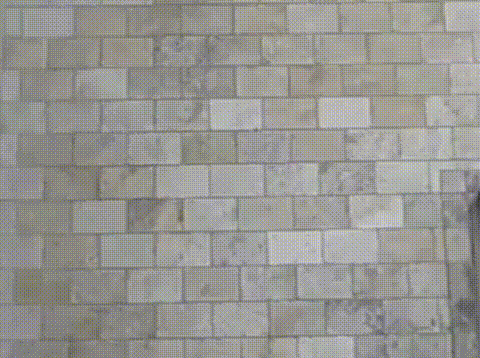

# People Counting 🚶‍♂️

Projet de comptage de personnes en temps réel à partir d'une vidéo, utilisant YOLO et OpenCV.

## Fichiers
- `CountingPeople.py` : Script principal de détection et comptage
- `extraire.py` : Extraction des frames d'une vidéo

## Demo

